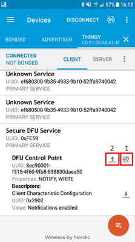
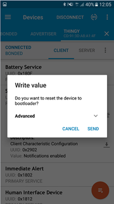

===================================
Updating firmware with nRF Connect for Mobile
===================================

This page explains how to update a device's firmware using `nRF Connect for Mobile <https://www.nordicsemi.com/eng/Products/Nordic-mobile-Apps/nRF-Connect-for-mobile-previously-called-nRF-Master-Control-Panel>`_.

Overview
--------

1. _`Provide your public key`.

#. _`Prepare the bootloader`.

#. _`Run DFU`. 
 

********

Provide your public key
----------------------

Before a **device firmware update** (DFU), you must prepare your device by replacing the existing bootloader with one that uses your own public key.

Copy the ``public_key.c`` file from where you generated it to ``<InstallFolder>\project\bootloader_secure\dfu_public_key.c``.

Prepare the bootloader
----------------------

1.	Compile a new bootloader using either Keil μVision or GCC. 

2. Flash the compiled bootloader to the device. Remember to program the Softdevice as well.

Run DFU
-------

The following procedure involves using a phone or tablet with nRF Connect for mobile installed to run DFU:

1.	Transfer the DFU zip package to your phone.

2.	Power on the device. 

3.  Open nRFConnect on your phone.

4.	Click **Scan**. From the available discovered devices, connect to your device. 

.. note::
     The discovered devices list doesn't automatically refresh when devices stop advertising. If you can't connect to a device from the list, refresh the list to see if the device is still available. 

5.	Expand the **Secure DFU Service** section. There are two icons to the right of **DFU Control Point**:

    a. Check (x) the box to turn notifications **on**.

    b. Check (x) the box to the left to set the device to **bootloader (DFU)** mode. 

6. Click **OK** when prompted to reset the device to bootloader. 
                                      

    
        Activating DFU mode

        Restarting device in DFU mode

The device now enters DFU mode. 

7. Go to the **Scanner** tab and run a new scan. A device with ``<name>DFU`` appears in the list of discovered devices. 

8. Choose your device.

9. Connect to the new device. 

10. Click the DFU icon. 

    .. image:: images/Picture4.png
        :alt:Running DFU

        Running DFU

11. Select **Distribution packet (ZIP)**.

12. Navigate to the package that you previously uploaded to your mobile device.

13. Click **OK**.

    .. image:: images/Picture5.png
        :alt: Selecting the package

        Selecting the package

 The package is now uploaded to the device.